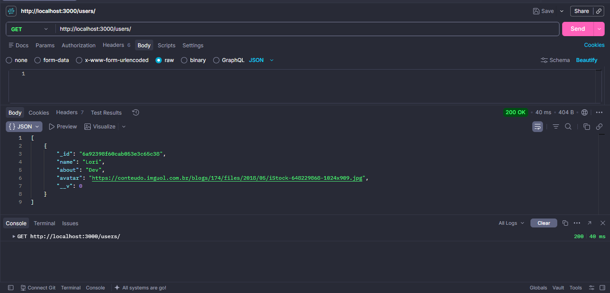
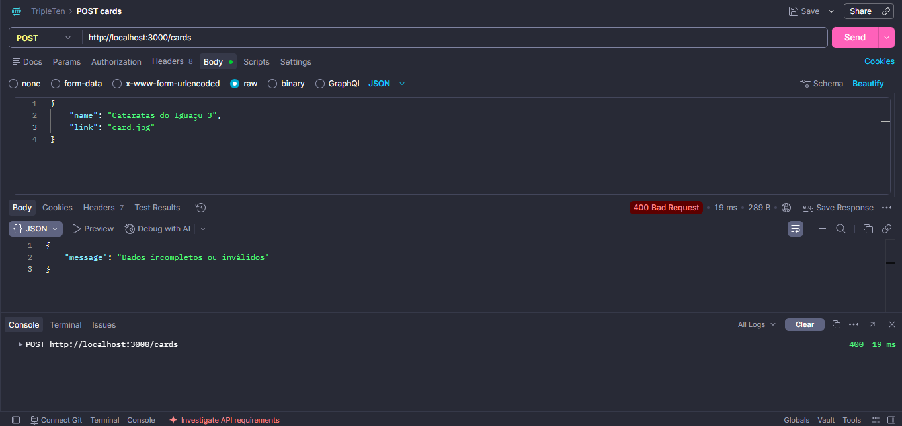
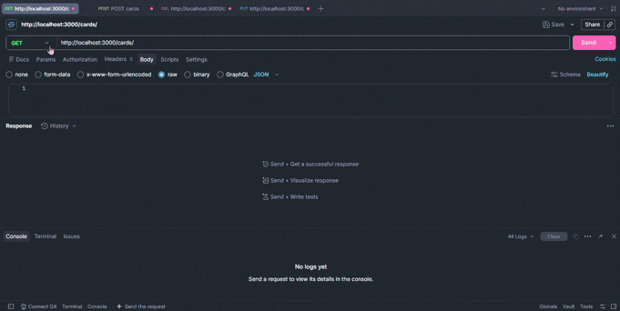

# Tripleten - Around The U.S. (Backend API)


O **Around The U.S.** é uma API RESTful desenvolvida em Node.js com Express.js, integrada a um banco de dados MongoDB.

Este projeto atua como o backend de uma aplicação social, permitindo o gerenciamento de perfis de usuários, uma galeria de fotos com curtidas. No projeto, foram implementadas operações CRUD, modelagem de dados, validação e tratamento de erros.

## Funcionalidades

- **Gerenciamento de usuários:** criação de usuários, busca de todos os usuários ou por ID, atualização de perfil e avatar.
- **Gerenciamento da galeria de fotos:** criação de novos cards, busca de todos os cards e exclusão de card por ID.
- **Interação social:** atualização para curtir e descurtir cards.
- **Validação de dados:** expressões regulares (Regex) garantem que apenas URLs válidas sejam aceitas para avatares e links de imagens.
- **Tratamento de erros:** respostas personalizadas para:
  - `400`: dados inválidos enviados na requisição
  - `404`: Usuário, card ou rota não encontrados
  - `500`: eros internos do servidor

## Tecnologias e Ferramentas

- **Node.js**: ambiente de execução JavaScript no servidor
- **Express.js**: framework para estruturação de rotas e middlewares
- **MongoDB**: banco de dados NoSQL
- **Mongoose**: biblioteca ODM (Object Data Modeling) para modelagem de esquemas e interação com o banco de dados
- **ESLint**: linter de código configurado com as regras rígidas do `airbnb-base` para padronização

## Como executar o projeto

```bash
npm install
npm run start
```

O servidor ficará disponível em: http://localhost:3000.

## Endpoints da API (rotas)

Abaixo estão as rotas disponíveis nesta API. Você pode consumi-las utilizando ferramentas como Postman ou via cURL.

### Users

- `GET /users` - retorna todos os usuários
- `GET /users/:userId` - retorna os dados de um usuário específico pelo ID
- `POST /users` - cria um novo usuário e retorna os dados desse usuário criado
- `PATCH /users/me` - atualiza o perfil do usuário atual e retorna os dados atualizados
- `PATCH /users/me/avatar` - atualiza o avatar do usuário atual e retorna os dados atualizados

### Cards

- `GET /cards` - retorna todos os cards
- `POST /cards` - cria um novo card
- `DELETE /cards/:cardId` - deleta um card específico pelo ID
- `PUT /cards/:cardId/likes` - adiciona curtida a um card
- `DELETE /cards/:cardId/likes` - remove curtida de um card

## Demonstração da API

### Retorno de sucesso (status 200)



### Tratamento de Erros de Validação (Status 400)



### Demonstração do fluxo de criação e listagem de cards



## Autora

Desenvolvido por [Lorena Mendes](https://github.com/lorimendes).  
Conecte-se comigo no [LinkedIn](https://www.linkedin.com/in/lorenamendes0/).
